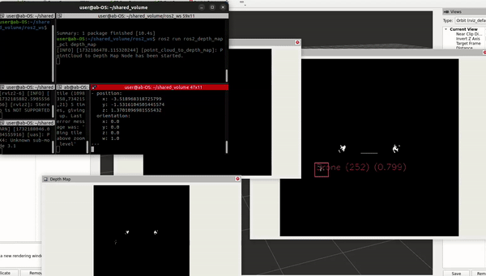
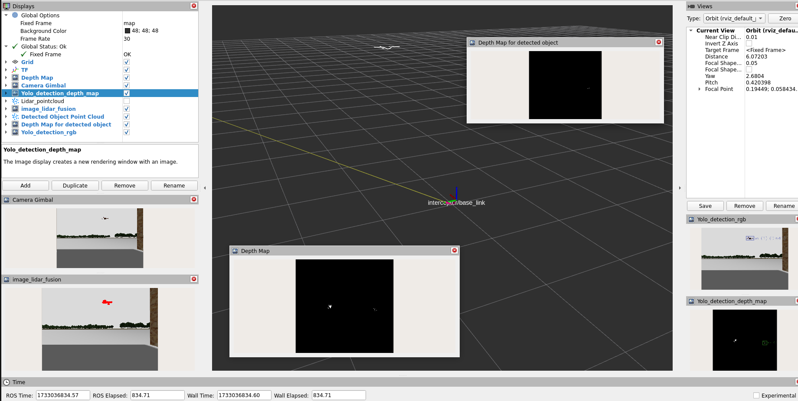

# ROS2 360° Multi-Sensor Object Detection and Localization 🤖📡

## 📝 Description

This repository provides a cutting-edge ROS2 solution for comprehensive 360° object detection and localization, leveraging advanced sensor fusion techniques. By integrating LiDAR point clouds, depth maps, and RGB imagery, the packages offer robust and real-time object tracking and positioning.

## 🚀 Key Features

### Lidar-Camera Fusion Package
- **Dynamic Sensor Fusion**: Seamless integration of LiDAR and camera data
- **Real-Time 3D Localization**: Precise object position estimation
- **Point Cloud Projection**: Accurate mapping of LiDAR points onto camera frames
- **Multi-Object Detection**: Simultaneous tracking of multiple objects

### Depth Map Detection Package
- **Intelligent Depth Mapping**: Convert point clouds to comprehensive depth representations
- **Object-Specific Depth Analysis**: Isolate and highlight object depths
- **3D Pose Estimation**: Calculate precise object positions and orientations
- **Real-Time Tracking**: Continuous object monitoring

## 🎥 Demonstration

### Sensor Fusion Workflow
| Lidar-Camera Fusion | Depth Map Detection |
|:---:|:---:|
|  |  |
| **Precise Object Localization** | **Depth-Based Object Detection** |

Entire System |
<div align="center">
   
</div>

## 🛠️ Installation & Setup

### 📋 Prerequisites

#### System Requirements
- ROS2 Humble ([Installation Guide](https://docs.ros.org/en/humble/Installation.html))
- YOLOvX ROS ([Setup Instructions](https://github.com/mgonzs13/yolov8_ros))
- GCC 8 or newer
- Dependencies: PCL, OpenCV

#### Install System Dependencies
```bash
sudo apt-get update
sudo apt-get install libpcl-dev libopencv-dev
```

### 1. Clone Repository
```bash
cd ~/ros2_ws/src
git clone --recurse-submodules https://github.com/AbdullahGM1/hybrid_multi_sensor_fusion_for_360_object_detection_and_localization.git

```

### 2. Modify Launch Files

#### Lidar-Camera Fusion Package Launch File
Located in: `ros2_lidar_camera_fusion_with_detection_cpp/launch/`

##### Depth Range Configuration
```python
parameters=[
    {'min_depth': 0.2, 'max_depth': 10.0},  # Adjust depth range
]
```

##### Sensor Frame Configuration
```python
parameters=[
    {'lidar_frame': 'source/frame/name',    # Update source LiDAR frame
     'camera_frame': 'target/frame/name'}   # Update target camera frame
]
```

##### Topic Remapping
```python
remappings=[
    ('/scan/points', '/your/lidar/topic'),
    ('/interceptor/gimbal_camera_info', '/your/camera/info/topic'),
    ('/interceptor/gimbal_camera', '/your/camera/image/topic'),
    ('/yolo/tracking', '/your/yolo/tracking/topic')
]
```

##### YOLO Configuration
```python
launch_arguments={
    'model': '/path/to/your/yolo/model.pt',
    'threshold': '0.5',
    'input_image_topic': '/interceptor/gimbal_camera',
    'device': 'cuda:0'  # or 'cpu'
}
```

#### Depth Map Detection Package Launch File
Located in: `ros2_depth_map_detection_localization_cpp/launch/`

##### Depth Map Parameters
```python
parameters=[
    {'width': 650,     # Depth map width
     'height': 650,    # Depth map height
     'scale': 50,      # Depth map scale
     'min_depth': 0.2, # Minimum depth
     'max_depth': 30.0 # Maximum depth
    }
]
```

##### Topic Remapping
```python
remappings=[
    ('/scan/points', '/your/lidar/point/cloud/topic'),
    ('/yolo/tracking', '/your/yolo/tracking/topic')
]
```

##### YOLO Configuration
```python
launch_arguments={
    'model': '/path/to/your/yolo/model.pt',
    'threshold': '0.5',
    'input_image_topic': '/depth_map',
    'device': 'cuda:0'  # or 'cpu'
}
```

### 3. Build the Packages
```bash
cd ~/ros2_ws
colcon build --packages-select hybrid_multi_sensor_fusion_for_360_object_detection_and_localization
source install/setup.bash
```

### 4. Run the Launch File
```bash
ros2 launch hybrid_multi_sensor_fusion_for_360_object_detection_and_localization 360_object_detection_and_localization.launch.py
```

## 🔬 Detailed Node Information

### Lidar-Camera Fusion Node

#### Subscribed Topics
| Topic | Message Type | Description |
|-------|--------------|-------------|
| `/scan/points` | `sensor_msgs/PointCloud2` | Raw LiDAR data |
| `/interceptor/gimbal_camera` | `sensor_msgs/Image` | Camera stream |
| `/yolo/tracking` | `vision_msgs/Detection2DArray` | Object detections |

#### Published Topics
| Topic | Message Type | Description |
|-------|--------------|-------------|
| `/image_lidar` | `sensor_msgs/Image` | LiDAR-annotated image |
| `/detected_object_distance` | `std_msgs/Float32MultiArray` | Object distances |

### Depth Map Detection Node

#### Subscribed Topics
| Topic | Message Type | Description |
|-------|--------------|-------------|
| `/scan/points` | `sensor_msgs/PointCloud2` | Raw LiDAR data |
| `/yolo/tracking` | `vision_msgs/Detection2DArray` | Object detections |

#### Published Topics
| Topic | Message Type | Description |
|-------|--------------|-------------|
| `/original_depth_map` | `sensor_msgs/Image` | Scene depth map |
| `/detected_objects_pose` | `geometry_msgs/PoseArray` | Object 3D poses |

## 🤝 Contributing

Contributions are welcome! Please:
- Open issues for bugs or feature requests
- Submit pull requests with improvements
- Follow existing code style and documentation practices

## 📜 License

MIT License

## 🚨 Important Configuration Tips
- Verify sensor frame names
- Ensure topic names match your setup
- Adjust depth ranges based on sensor specifications
- Select appropriate YOLO model
- Choose CUDA or CPU based on your hardware
