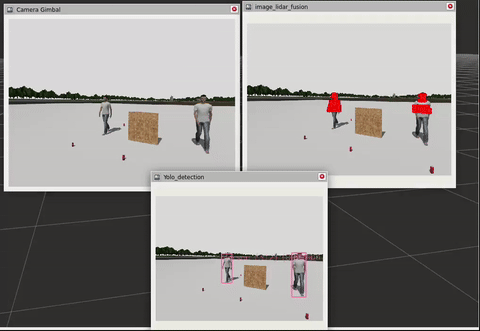

# ROS2 360° Object Detection and Localization Packages

## 📝 Description

This repository contains two complementary ROS2 packages designed for advanced multi-sensor object detection and localization:

1. **Lidar-Camera Fusion Package**
2. **Depth Map Detection and Localization Package**

These packages provide a comprehensive solution for 360° object detection and localization using advanced sensor fusion techniques, leveraging LiDAR point clouds, depth maps, and RGB data.

## 🚀Key Features

### Lidar-Camera Fusion Package
- Dynamic transform handling between sensor frames
- 3D position estimation within object bounding boxes
- Real-time point cloud projection onto camera images
- Multi-object detection and localization

### Depth Map Detection Package
- Point cloud to depth map conversion
- Object-specific depth map generation
- 3D pose estimation for detected objects
- Multi-object real-time tracking

## 🖼️ Demonstrations

### Comprehensive Sensor Fusion Workflow

Our integrated system provides a complete solution for object detection and localization:

#### Lidar-Camera Fusion
<p align="center">
  
  <br>
  <strong>Key Visualization:</strong> Lidar points overlaid on camera image, showing precise object localization
</p>

##### Lidar-Camera Fusion Capabilities
- **Point Cloud Projection**: Accurately maps LiDAR points onto camera frames
- **Object Boundary Tracking**: Highlights detected objects with point cloud data
- **Real-time Processing**: Provides instant 3D object positioning

#### Depth Map Detection
<p align="center">
  
  <br>
  <strong>Key Visualization:</strong> Depth map generation and object localization
</p>

##### Depth Map Detection Capabilities
- **Scene Depth Mapping**: Converts point clouds to comprehensive depth representations
- **Object-Specific Depth Isolation**: Highlights depths for detected objects
- **3D Pose Estimation**: Calculates precise object positions

### Integrated Detection Workflow
1. **LiDAR Point Cloud Acquisition**
2. **Camera Image Processing**
3. **Object Detection with YOLO**
4. **Depth Map Generation**
5. **3D Position Estimation**
6. **Multi-Object Tracking**

## 🛠️ Technologies

- **Framework**: ROS2 Humble
- **Programming**: C++
- **Libraries**: 
  - PCL (Point Cloud Library)
  - OpenCV
  - YOLOv8 for object detection
## 🔧 Installation

### 📋 Prerequisites
- **🤖 ROS2 Humble** ([Installation Guide](https://docs.ros.org/en/humble/Installation.html))
- **🕵️ YOLOvX ROS** ([Setup Instructions](https://github.com/mgonzs13/yolov8_ros))
- **💻 C++ Compiler**: GCC 8 or newer
- **📚 Required Libraries**: PCL, OpenCV, and standard ROS2 dependencies

### Install Dependencies
```bash
sudo apt-get update
sudo apt-get install libpcl-dev libopencv-dev
```

### Clone Repositories
```bash
cd ~/ros2_ws/src
git clone https://github.com/AbdullahGM1/hybrid_multi_sensor_fusion_for_360_object_detection_and_localization.git
```

## 🛠️ Launch File Configurations

### Lidar-Camera Fusion Package Launch File Modifications

Located in: `ros2_lidar_camera_fusion_with_detection_cpp/launch/`

#### 1. Depth Range Configuration
```python
parameters=[
    {'min_depth': 0.2, 'max_depth': 10.0},  # Adjust x-axis depth range
]
```
- **min_depth**: Minimum detection distance
- **max_depth**: Maximum detection distance

#### 2. Sensor Frame Configuration
```python
parameters=[
    {'lidar_frame': 'source/frame/name',    # Source LiDAR frame
     'camera_frame': 'target/frame/name'}   # Target camera frame
]
```
- Set correct source and target frames for accurate transformation

#### 3. Topic Remapping
```python
remappings=[
    ('/scan/points', '/lidar/topic/name'),           # LiDAR point cloud topic
    ('/interceptor/gimbal_camera_info', '/camera/info/topic'),  # Camera info topic
    ('/interceptor/gimbal_camera', '/camera/image/topic'),      # Camera image topic 
    ('/yolo/tracking', '/yolo/tracking/topic')       # YOLO tracking topic
]
```
- Replace with your specific topic names

#### 4. YOLO Configuration
```python
launch_arguments={
    'model': '/path/to/your/yolo/model.pt',
    'threshold': '0.5',
    'input_image_topic': '/interceptor/gimbal_camera',
    'device': 'cuda:0'
}
```
- Specify YOLO model path
- Set detection threshold
- Choose inference device

### Depth Map Detection Package Launch File Modifications

Located in: `ros2_depth_map_detection_localization_cpp/launch/`

#### 1. Depth Map Parameters
```python
parameters=[
    {'width': 650,     # Depth map width
     'height': 650,    # Depth map height
     'scale': 50,      # Depth map scale
     'min_depth': 0.2, # Minimum depth
     'max_depth': 30.0 # Maximum depth
    }
]
```
- Configure depth map dimensions and range

#### 2. Topic Remapping
```python
remappings=[
    ('/scan/points', '/lidar/point/cloud/topic'),   # LiDAR point cloud topic
    ('/yolo/tracking', '/yolo/tracking/topic')      # YOLO tracking topic
]
```
- Map to your specific topic names

#### 3. YOLO Configuration
```python
launch_arguments={
    'model': '/path/to/your/yolo/model.pt',
    'threshold': '0.5',
    'input_image_topic': '/depth_map',  # Fixed input topic
    'device': 'cuda:0'
}
```
- Specify YOLO model path
- Set detection threshold
- Choose inference device

### 🚨 Important Configuration Tips
- Always verify sensor frame names
- Ensure topic names match your setup
- Adjust depth ranges based on your sensor specifications
- Select appropriate YOLO model for your use case
- Choose CUDA or CPU based on your hardware

## Build Packages
```bash
cd ~/ros2_ws
colcon build --packages-select hybrid_multi_sensor_fusion_for_360_object_detection_and_localization
source install/setup.bash
```
## 🚀 Usage

### Run the Launch File
```bash
ros2 launch hybrid_multi_sensor_fusion_for_360_object_detection_and_localization 360_object_detection_and_localization.launch.py
```

## 🔬 Node Details

### Lidar-Camera Fusion Node: `lidar_camera_fusion_node`

#### Node Purpose
A sophisticated ROS2 node that performs real-time sensor fusion between LiDAR point clouds and camera imagery, enabling comprehensive object detection and localization.

#### Subscribed Topics
| Topic | Type | Description |
|-------|------|-------------|
| `/scan/points` | `sensor_msgs/PointCloud2` | Raw LiDAR point cloud data |
| `/interceptor/gimbal_camera` | `sensor_msgs/Image` | Camera image stream |
| `/interceptor/gimbal_camera_info` | `sensor_msgs/CameraInfo` | Camera intrinsic parameters |
| `/yolo/tracking` | `vision_msgs/Detection2DArray` | Object bounding boxes from YOLO detector |

#### Published Topics
| Topic | Type | Description |
|-------|------|-------------|
| `/image_lidar` | `sensor_msgs/Image` | Camera image with projected LiDAR points |
| `/detected_object_distance` | `std_msgs/Float32MultiArray` | Average distances of detected objects |
| `/detected_object_pointcloud` | `sensor_msgs/PointCloud2` | Point clouds for each detected object |

#### Node Parameters
| Parameter | Type | Default | Description |
|-----------|------|---------|-------------|
| `min_depth` | float | 0.2 | Minimum depth filtering for point clouds |
| `max_depth` | float | 10.0 | Maximum depth filtering for point clouds |
| `lidar_frame` | string | - | Source LiDAR coordinate frame |
| `camera_frame` | string | - | Target camera coordinate frame |

#### Processing Pipeline
1. Transform LiDAR point clouds to camera coordinate frame
2. Filter point clouds based on depth range
3. Project LiDAR points onto camera image
4. Associate points with YOLO detected objects
5. Compute object-specific point cloud statistics

### Depth Map Detection Node: `depth_map_detection_node`

#### Node Purpose
A specialized ROS2 node that converts point cloud data into depth maps, detecting and localizing objects with precise 3D positioning.

#### Subscribed Topics
| Topic | Type | Description |
|-------|------|-------------|
| `/scan/points` | `sensor_msgs/PointCloud2` | Raw LiDAR point cloud data |
| `/yolo/tracking` | `vision_msgs/Detection2DArray` | Object bounding boxes from YOLO detector |

#### Published Topics
| Topic | Type | Description |
|-------|------|-------------|
| `/original_depth_map` | `sensor_msgs/Image` | Depth map of entire scene |
| `/object_depth_map` | `sensor_msgs/Image` | Depth map highlighting detected objects |
| `/detected_objects_pose` | `geometry_msgs/PoseArray` | 3D poses of detected objects |
| `/object_point_clouds` | `sensor_msgs/PointCloud2` | Point clouds for each detected object |

#### Node Parameters
| Parameter | Type | Default | Description |
|-----------|------|---------|-------------|
| `width` | int | 650 | Depth map width |
| `height` | int | 650 | Depth map height |
| `scale` | int | 50 | Depth map scaling factor |
| `min_depth` | float | 0.2 | Minimum depth range |
| `max_depth` | float | 30.0 | Maximum depth range |

#### Processing Pipeline
1. Convert point cloud to depth map
2. Generate scene-wide depth representation
3. Isolate depth information for detected objects
4. Calculate 3D pose for each detected object
5. Publish object-specific point clouds and poses


## 🤝 Contributing

Feel free to contribute to this project by creating pull requests or opening issues! 🌟 Your input is welcome and appreciated! 💡
